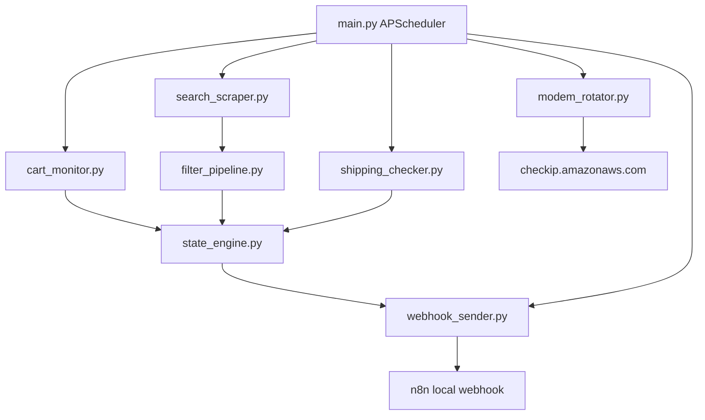

# Build Pokémon Amazon Monitor

## Scope
Implement a full, runnable app under `amazon_monitor/` that matches the target modules and behavior, while removing obsolete/legacy files that conflict with your architecture.

## Files To Create/Replace
- Core runtime modules:
  - [c:\Users\Eyal\dev\Amazon Scraper\amazon_monitor\browser_factory.py](c:\Users\Eyal\dev\Amazon Scraper\amazon_monitor\browser_factory.py)
  - [c:\Users\Eyal\dev\Amazon Scraper\amazon_monitor\search_scraper.py](c:\Users\Eyal\dev\Amazon Scraper\amazon_monitor\search_scraper.py)
  - [c:\Users\Eyal\dev\Amazon Scraper\amazon_monitor\cart_monitor.py](c:\Users\Eyal\dev\Amazon Scraper\amazon_monitor\cart_monitor.py)
  - [c:\Users\Eyal\dev\Amazon Scraper\amazon_monitor\shipping_checker.py](c:\Users\Eyal\dev\Amazon Scraper\amazon_monitor\shipping_checker.py)
  - [c:\Users\Eyal\dev\Amazon Scraper\amazon_monitor\filter_pipeline.py](c:\Users\Eyal\dev\Amazon Scraper\amazon_monitor\filter_pipeline.py)
  - [c:\Users\Eyal\dev\Amazon Scraper\amazon_monitor\state_engine.py](c:\Users\Eyal\dev\Amazon Scraper\amazon_monitor\state_engine.py)
  - [c:\Users\Eyal\dev\Amazon Scraper\amazon_monitor\modem_rotator.py](c:\Users\Eyal\dev\Amazon Scraper\amazon_monitor\modem_rotator.py)
  - [c:\Users\Eyal\dev\Amazon Scraper\amazon_monitor\webhook_sender.py](c:\Users\Eyal\dev\Amazon Scraper\amazon_monitor\webhook_sender.py)
  - [c:\Users\Eyal\dev\Amazon Scraper\amazon_monitor\main.py](c:\Users\Eyal\dev\Amazon Scraper\amazon_monitor\main.py)
  - [c:\Users\Eyal\dev\Amazon Scraper\amazon_monitor\first_time_setup.py](c:\Users\Eyal\dev\Amazon Scraper\amazon_monitor\first_time_setup.py)
- Config/assets:
  - [c:\Users\Eyal\dev\Amazon Scraper\amazon_monitor\config.yaml](c:\Users\Eyal\dev\Amazon Scraper\amazon_monitor\config.yaml)
  - [c:\Users\Eyal\dev\Amazon Scraper\amazon_monitor\.env](c:\Users\Eyal\dev\Amazon Scraper\amazon_monitor\.env)
  - [c:\Users\Eyal\dev\Amazon Scraper\amazon_monitor\blacklist.txt](c:\Users\Eyal\dev\Amazon Scraper\amazon_monitor\blacklist.txt)
  - [c:\Users\Eyal\dev\Amazon Scraper\amazon_monitor\requirements.txt](c:\Users\Eyal\dev\Amazon Scraper\amazon_monitor\requirements.txt)
- Optional helpers:
  - [c:\Users\Eyal\dev\Amazon Scraper\amazon_monitor\tools\check_ip.py](c:\Users\Eyal\dev\Amazon Scraper\amazon_monitor\tools\check_ip.py)
  - [c:\Users\Eyal\dev\Amazon Scraper\amazon_monitor\tools\log_rotator.py](c:\Users\Eyal\dev\Amazon Scraper\amazon_monitor\tools\log_rotator.py)

## Cleanup
- Remove/retire architecture-conflicting files:
  - `router_restart.py` (superseded by `modem_rotator.py`)
  - `whatsapp_web.py` (superseded by `webhook_sender.py`; Python won’t send WhatsApp directly)
  - `priority_items.txt` (cart itself defines priority)
- Keep runtime directories (`auth/`, `data/`, `logs/`) and ensure startup creates missing ones safely.

## Implementation Approach
- Build a shared config/env/logging foundation used by all modules.
- Implement Playwright Chrome stealth context factory + global token-bucket limiter and enforce token acquisition before every navigation.
- Implement search scraping with CAPTCHA detection, anti-detection jitter/scroll behavior, extraction normalization (`asin/title/price/in_stock/image_url/seller`).
- Implement persistent cart and shipping flows with session-expiry detection.
- Implement SQLite state engine (WAL + thread lock) and all alert generation/cooldown rules:
  - Cart: no “new product” alert, 5-minute price-drop cooldown.
  - Search: “new product” alerts, 24-hour price-drop cooldown.
  - Stock flip alerts and shipping-change alerts.
- Implement webhook sender payload contract for n8n including canonical affiliate link + image URL passthrough.
- Implement modem reconnect/IP verification and unchanged-IP failure handling.
- Implement APScheduler orchestration with per-job exception handling, CAPTCHA pause/recover logic, heartbeat, and stop-on-session-expiry behavior for cart/shipping jobs.
- Implement interactive first-time setup for Amazon login persistence + webhook smoke test.

## Validation Plan
- Static validation: importability and syntax checks for all modules.
- Runtime smoke sequence:
  - `first_time_setup.py` interactive login + webhook test.
  - One-shot `search_scraper` and `cart_monitor` dry runs.
  - End-to-end `main.py` startup with scheduler and log output.
- Confirm alerts include `image_url` and `https://www.amazon.com/dp/{asin}?tag={affiliate_tag}` only.

## Data/Flow Diagram

## Deliverable Format
- After implementation, provide every file as a separate code block with its full path, exactly as requested.